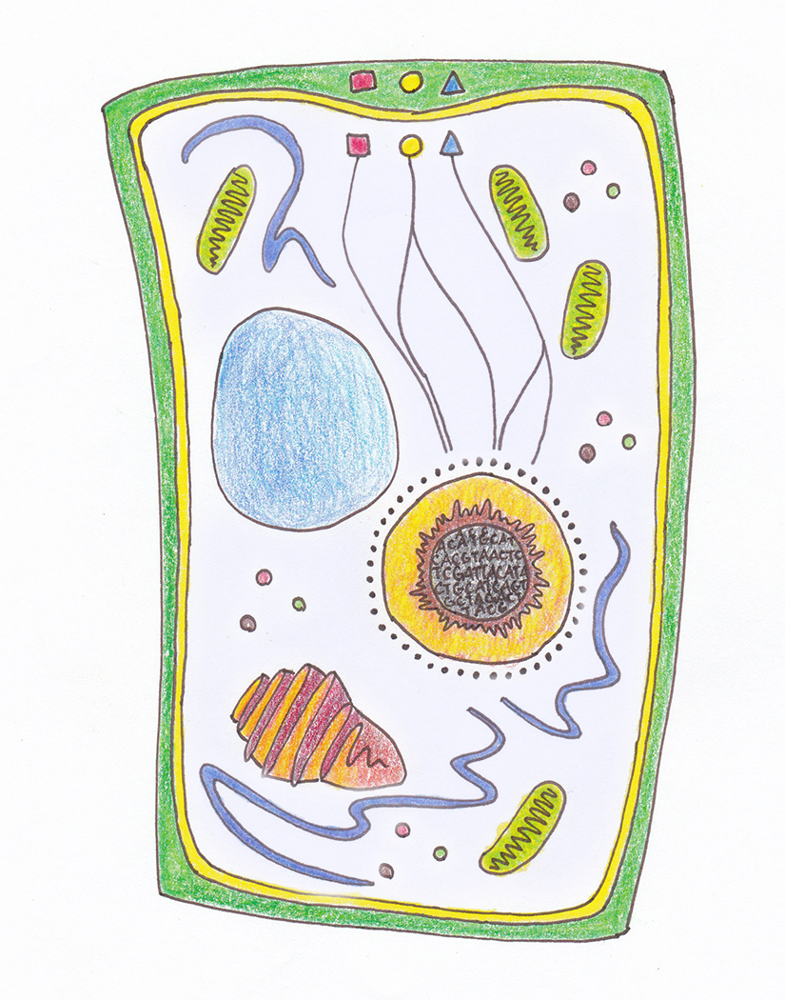
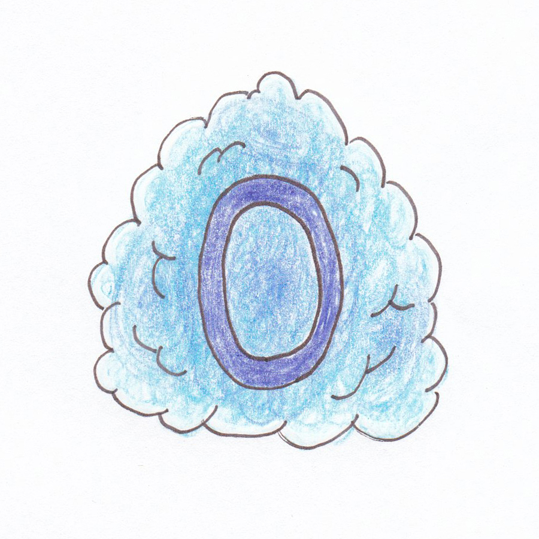
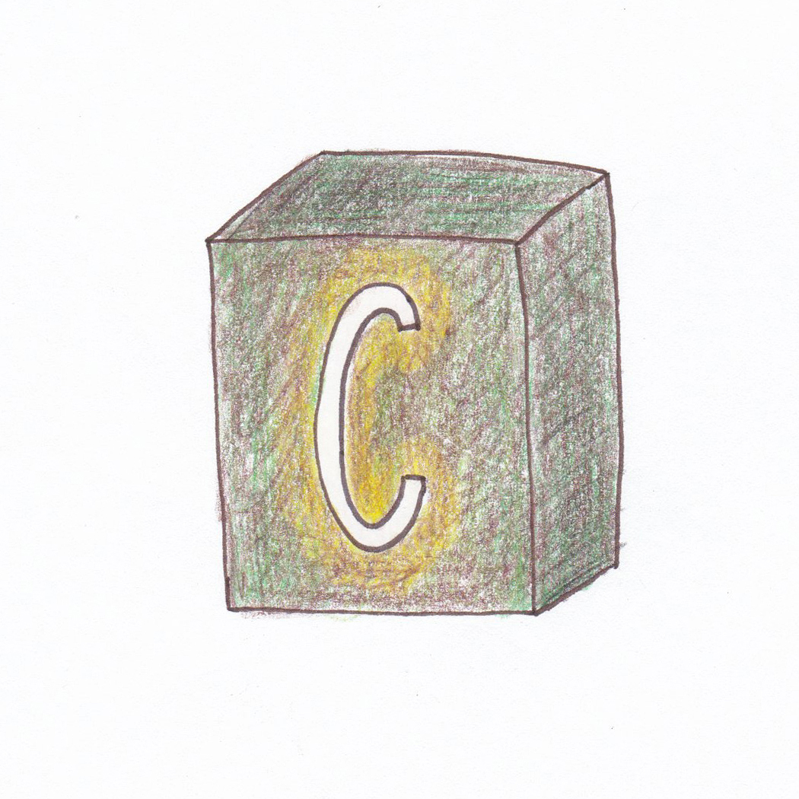
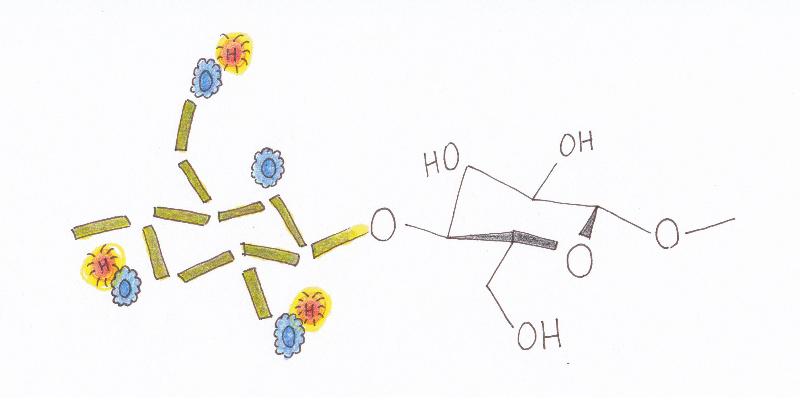
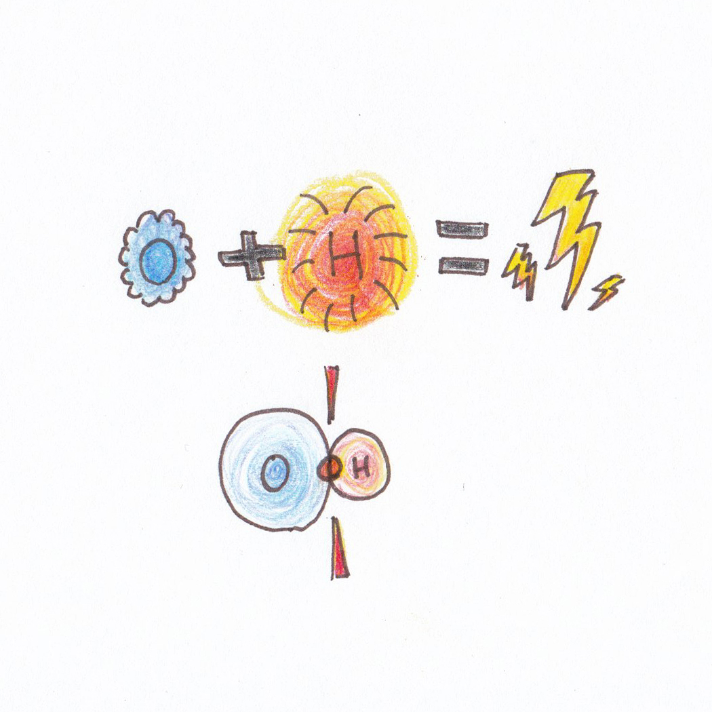
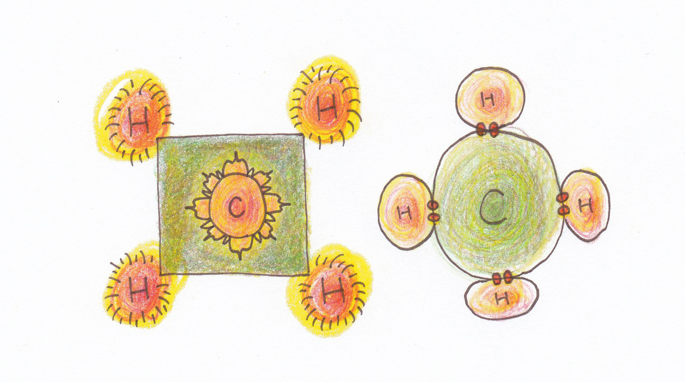
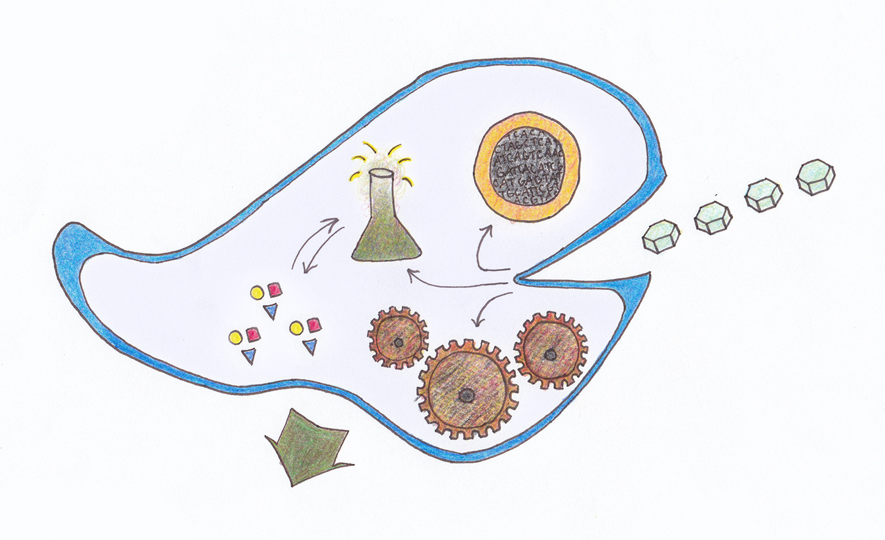

|  |
| :-- |
| The main action of cells is called the Central Dogma (DNA → RNA → proteins) and here's what happens. Compounds enter through receptors in the cell wall (primary shapes). The chemical signals (pathway lines) are broken down and processed. They eventually reach the nuclear membrane, where transporters called ribosomes (black dots) carry messages to the nucleus and around the cell. The nucleus checks what DNA it needs, pulls it up, and converts it to RNA (nuclear sunburst). The RNA response has directions on how to make different proteins (not pictured). These proteins use the energy from mitochondria (green squiggles) to help the cell respond to the stimulus.  This could be either a plant or a fungus cell, by the way. A fungus would have a smaller Golgi apparatus (red and orange folds) to package proteins like a post office. A plant would have chloroplasts (not pictured) to perform photosynthesis. The endoplasmic reticulum (purple tubes) is like a subway for proteins. Vacuoles (blue circle) store water, and globules (colored dots) store nutrients. |

# Introduction

The current insight into the living stuff of cells is far past Anglo-Saxon times.
In fact, science grows so fast today that only Latin can keep up with all the new wisdom!
This is because you can take parts of Latin and Greek words and make endless new words.

Having so many words like this makes it possible study `bio` `mechanic` `immuno` `engineering`.
How about `chemo` `synth` `etic` `tissue` `re` `gener` `ation` `praxis`? 🙃
But where would we be without `micro` `liters`?
Most of our science is Latin and this is a good thing.

This document is the content of a class for kindergarten to 4th-grade children.
It's designed to be a supervised, bring-your-own-vegetables class on lactic acid fermentation.
The illustrations are original and depict the mood of *Uncleftish Beholding,* the textbook of sorts.

# Uncleftish Beholding

Poul Anderson's 1989 text is about if English chemistry developed along purely Germanic lines.
The Norman Conquest of 1066 brought high contact with French and Latin speakers and permanently changed the language.
Anglish is a tongue-in-cheek reconstructed dialect that points to English's Anglo-Saxon roots.

I have a pet `hypo` `thesis` that German did well and a science and philosophy language in earlier times:
the words are literal and it's like moving ideas around in physical space, easier to grasp.
You can taste the sourness of *Sauerstoff* (oxygen) and recall sauerkraut and vinegar when you say it.

Kids can learn biology from the special insights that Germanic words bring.
So let's look at the text and see what we can learn!

## The introductory spirit

> With the growth of worldken, we began to learn, and today we have a beholding of stuff and work that watching bears out, both in the workstead and in daily life.

Pursue your passions in science and do things that help your life.
In German, when you *kennen lernen,* it's usually in the `con` `text` of meeting a person.
That's not to say that *Wissenschaft* is lonely, because there's a society in it just like *Gesellschaft.*

Nature is wonderful and entertaining when you carefully observe it and behold the results.
Something so great that it forms the roots of life on eath, made the thing under your microscope.
The lessons of biology carry over into real life, a new understanding of life.

## Building blocks: organic chemistry

**Firststuffs.**
Elements combine to form *bulkbits* (molecules) and *bindings* (compounds).
The elements are called the first stuff because they're *uncleftish.*
You can't divide them into smaller parts, unlike how a horse's cleft hoof is split in the middle.

All the elements like hydrogen, oxygen, nitrogen, carbon, and sulphur combine as molecules.
The way the bits are arranged, and the number of elements in them, changes how the molecules act.
For example, many different foodstuffs are only made of carbon, hydrogen, and oxygen:

- the simple sugars in honey, fruit, chocolate cake, and other sweet things;
- the complex sugars in whole grains, vegetables, beans, nuts, and seeds;
- the fats in eggs, butter, and milk; certain fruits like olives and avocados; and meat and nuts; and
- the protein that normally comes with fatty foods and certain legumes like beans.[^food1992]

If you think about it, those three elements are responsible for all family dinners ever.
But that's not all there is to having a healthy diet of whole foods.

|  |  |  |
| :-- | :-- | :-- |
| Hydrogen or *waterstuff.* | Oxygen or *sourstuff.* | Carbon or *coalstuff.* |

**Bulkbits.**
Eating many different foods gives you different vitamins and minerals as well.
Those are other more rare and special molecules, like antioxidants and melanins,
and Vitamin C to fight scurvy and Vitamin A for healthy skin.

Every plant and animal makes its own chemical molecules to help it survive and bear children.
That avocado may be nutritious, but it needs to be healthy so a new tree can grow from it.
The very organism is beholden to the cells that comprise it, tireless biochemistry machines buzzing with energy.

A good rule of thumb for separating out molecules (simpler) and compounds (more complex):
all compounds are molecules, but not all molecules are compounds.
For example, O2 is a molecule but not a compound.
Rust (Fe2O3) is a compound of oxidized iron and you can also study "rust molecules."

|  |
| :-- |
| Cellulose (C6H10O5) is the main structural sugar in plants and fungi. It can combine to form very long chains with nutrients embedded in them. The thick black lines show the molecule's `stoi` `chio` `metry` or the physical arrangement of atoms in space. |

**Bindings.**
Most molecules are found stitched together in complex patterns called polymer chains.
These compounds are where life's action really happens:
the very complex and unique sugars in plant cell walls can have different effects as your body breaks them down.
Also, the cells can make their own compounds for many different reasons such as

- turning sunlight or food into nutrients,
- using the nutrients to grow or heal injuries,
- attacking competitors or removing parasites,
- sexually reproducing to continue the line.

Mushrooms are my personal interest.
Some species make powerful compounds that help your immune system learn new ways to fight disease.
Every drug, natural or manmade, is a chemical compound;
there are different kinds of drugs such as alkaloids, steroids, hormones, etc.

Drugs affect your body by fitting into specially shaped slots in the cell membrane or wall called receptors.
When a drug fits into a receptor is causes the cell to produce molecules that change which genes are active.
The change in gene expression lets the cell make new compounds to respond to the drug's chemical message.

## Common elemental chemical properties

**Waterstuff.**
Hydrogen (H2) is the lightest and most plentiful element and it forms the basis of all matter.
A colorless, odorless, ubiquitous gas that easily reacts with other elements.
Like other common gasses, it's so fleeting that molecules tend to pair up.

It's called *waterstuff* because it provides the spark needed to make water in a great explosion.
Water is biochemistry's natural medium: almost every reaction happens in an aqueous environment.

Many cultures have concepts for pneuma, chakra, spirit, life energy, and similar terms.
Hydrogen is the closest thing to this we can observe: an element that sparks everything.

Hydrogen and helium are called *sunstuff* because stars, cosmic engines of pure energy, are made of them.

**Sourstuff.**
Oxygen (O2) is another abundant gas and the other part of water.
It's called *sourstuff* because of its chemical effects:
not only do bacteria and yeast make sour-tasting compounds when oxygen is available,
but also dangerous substances like bleach, vitriol, permanganate, and potassium nitrare rely on it.

These are the extremes of wet and dry sourness: acid that can eat your skin, and powders that can explode.
The sourness spectrum is less dangerous in the shallow end.
The microbes in sauerkraut make lactic acid, and oxidizers are usually acids.
There's a field of chemistry called redox chemistry that studies what happens when oxygen-based compounds trade electrons.

For our purposes, however, the sourness in sauerkraut, kimchi, yoghurt, sourdough bread, etc., comes from lactic acid fermentation.
All this good and healthy food relies on oxygen or *sourstuff* to make the necessary molecules.

|  |
| :-- |
| Covalent bonds are very strong and difficult to break because the elements share electrons. Chemical reactions that involve covalent bonds usually need lots of energy to form and break. |

**Coalstuff.**
Carbon (12C) is the main solid element of biochemistry.
It forms the backbone of polymer chains and lets them bind together.
This gives compounds the power to do things like make cell walls.

There's a hypothetical field of biochemistry concerned with alternate life possibilities.
Silicon (Si) or *flintstuff,* another element similar to carbon, is one possibility with proof on earth.

Silica (SiO2) is the main component of quartz, sand, and glass.
Also, diatoms use it to form beautiful cell walls and spinach uses it to deter predators.
That's why your teeth feel raw after eating spinach: tiny glass particles embedded in the leaves.

Carbon comes in different forms such as graphite and diamonds.
It's also the main component of coal, peat, oil, and methane.
Other related elements include metals like

- Titanium (Ti) or *germanstuff,* first purified by Germans and used in military and aerospace engineering;
- Tin (Sn), used to solder things together and to make special alloys such as pewter and bronze; and
- Lead (Pb), a toxic metal that's very dense and can be alloyed with antimony to shield against radiation.

**Stonestuff.**
These are the elements in Group 1 of the periodic table, the alkali metals.
They're usually soft, shiny metals that easily react with oxygen and other elements.
Because of this, they tarnish easily.
Compared to gold, which never tarnishes unless it's alloyed with a reactive metal like copper.

- Lithium (Li) or *stonestuff,* used in mood stabilizing drugs
- Sodium (Na) or *glasswortstuff;* glasswort plant ashes were used in glassmaking
- Potassium (K) or *potashstuff;* potash is plant ashes and usually used in fertilizer
- Rubidium (Rb) or *redstuff,* used to give fireworks a red or purple color
- Caesium (Cs) or *bluegraystuff,* used in atomic clocks and vacuum electronics

**Chokestuff.**
Nitrogen (N2) the most abundant gas in air (78%) and and the fourth most abundant element in the human body (3%).
It's called *chokestuff* because nitrogenous compounds usually smell bad and make you gag.

The nitrogen in methane and peat comes from "nitrogen-fixing" organisms that can take nitrogen from the air and convert it into a form of energy for plants and microbes.
There are also certain microbes called `chemo` `trophs` that use nitrogen compounds for energy directly.
Nitrogen is what makes poo and pee smell bad, and it's also responsible for body odor.

Ammonia, fertilizer, and cyanide are all very bitter substances because of nitrogen.
Apple seeds and almonds have small amounts of cyanide (CN–) so they also taste bitter.
Isn't it strange and wonderful how sharp smells that make you gag, come from the same substance as the air you breathe?

|  |
| :-- |
| Hydrocarbons (CH4) are the main building blocks of organic energy. All kinds of fossil fuels like coal, oil, butane, propane, etc., are built from increasingly complex forms of this molecule. |

# Activity: making fermented vegetables

Making sauerkraut and other fermented vegetables is fun and easy to do at home.
A batch can easily last a year if kept clean and cold.
It requires no special equipment beyond

- a chopping knife and cutting board,
- a tablespoon of non-iodized sea salt,
- a half gallon (2–3 qt kraut) or gallon (6–8 qt) boiling pot, and
- a tablespoon of Greek yoghurt (recommended).

The best part is that the same technique can be used on almost any combination of vegetables.
If you don't know where to start, young children are reported to love fermented carrot–ginger sticks.
It's like a fancy version of carrot sticks that goes bad slow, cheap to make and much healthier.

## The lactate dehydrogenase pathway

Lactose fermentation is the process by which lactobacteria convert vegetable sugars into lactic acid and carbon dioxide.
The health benefits of fermented vegetables come from increased numbers of live bacteria, not the lactic acid itself.

The cells take up sugars, simple and complex, through the cell membrane.
Through a process called `glyco` `lysis`, the cell's chemicals break down the sugar.

Some of this sugar gets converted to lactic acid as a by-product of its breakdown.
This gives fermented food is sour taste, including kombucha and vinegar.

The rest of the sugar, along with dissolved oxygen in the brine, helps the cells grow.
It's converted into internal energy units called ATP that powers all the cell's functions.
The by-product of this is CO2 so it's important to burp the sauerkraut jars daily.

|  |
| :-- |
| The lactate dehydrogenase pathway in prokaryotic bacteria. Sugars like glucose (hexagon tablets) enter the cell through the membrane. Chemicals in the cell break it down and use it for different things. The sourness comes from lactic acid fermentation (flask). Two substances, pyruvate and lactate, are combined into ATP, and lactic acid is the by-product. The Krebs cycle (gears) makes ATP as a main product, and CO2 as a by-product. Cell replication (nucleus) helps the cells divide. |

## Technique and recipes

Sauerkraut, kimchi, and all similar foods at their core are vegetables fermented in brine.
The washed vegetables are packed into clean wide-mouth quart jars, covered with brine, and fermented anaerobically.

**Brine.**
The brine should be 1 tbsp non-iodized sea salt per quart of water.
It's important to boil the water so that any competing microbes are killed.
The brine is ready to use when you can touch the container with the back of your hand.

I like to add a spoonful of Greek yoghurt or skyr to a pint jar, shake vigorously, and return it to the main batch.
This starts the culture with lots of live lactobacteria and it imparts a delicious mild flavor.

After the fermentation is done and it's time to refrigerate the sauerkraut,
I discard the old brine and replace it with fresh brine without yoghurt.

If you have whey left over from cheesemaking, that can be used in place of water and yoghurt.
Whey is also good to drink chilled plain, in milkshakes, and to use as plant fertilizer.

**Vegetables.**
Most vegetables ferment well.
Cabbage and Brussels sprouts are the best.
Other good options are carrot and ginger;
green beans and snow peas;
and turnips, parsnips, and radishes.

Cabbage and Brussels sprouts are chopped finely for sauerkraut and coarsely for kimchi.
Fresh spices, chopped finely, can be added such as onions, garlic, ginger, and tumeric.
The same goes for turnips, parsnips, and radishes in sauerkraut.

Fermented carrot sticks are extremely good, especially with ginger.
Green beans and snow peas need only the ends removed.
Radishes make sticks that are on par with carrots.

It's also possible to ferment, in increasing order of difficulty,
- watery fruits and vegetables like tomatoes and cucumbers;
- starchy vegetables like potatoes, beets, and squash; and
- raw and cooked meat, and boiled eggs.

|  |
| :-- |
| `todo:` Photograph the assembled tools and ingredients. |

**Cleanliness.**
Please scrub all the vegetables with hot soapy water and rinse them thoroughly.
Wash the Mason jars the same day you use them, even if they're already clean.
Make sure that all surfaces, knives, etc., are clean and wash your hands frequently.

**Method.**
Cut the vegetables how you wish, pack them as tighly as possible leaving 1 in headspace, and cover with brine.
If you have a small flat weight that fits in the jar to keep the vegetables submerged, please add it.
*Gently use your palm against the glass, not a hard surface.*
Then close the jar and gently tap the bottom and rotate it, releasing any gas pockets.

This is important because the combination of salt and lack of air inhibits everything but lactobacteria.
If there are air pockets in the jar, or too much exposed to air at the top, mold may form.
A patch of mold ruins the whole jar because by the time you see it, it's spread throughout.

Seal the jars and ferment them in at room temperate in ambient light for 2 weeks.
Every day, check the jars by opening them to release the CO2 tha builds up.
They should exhale "happy" bubbles and a refreshing scent that instinctively smells good.

When the fermentation is done, you can put the same jars in the fridge and eat directly from them.
Because I use yoghurt in the fermentation brine, I use clean jars and fresh brine.
This removes the particles that build up at the bottom and the brine is crystal clear.

**How to Enjoy.**
Sauerkraut is excellent on sandwiches with corned beef and rye bread.
It's also good on burgers or anywhere that dill pickles are normally used.
I like to make sauerkraut omelettes and use it to spice up vegetable salads.

|  |
| :-- |
| `todo:` Photograph fermenting sauerkraut jars. |

## Some really good combinations

All the below recipes will benefit from adding yoghurt to the brine.
Spices, unmentioned invividually, are useful in certain forms:

- up to 10–12 whole black peppercorns per jar to taste;
- whole nutmeg chopped to the size of peppercorns;
- fresh parsely, cilantro, rosemary, basil, mint, etc.;
- dried but not powdered goods like lemon peel; and
- seeds, powders, and pastes, if part of the final product.

**Tumeric Sprout Kraut.**
Shred Brussels sprouts and add about 2 medium tumeric roots, finely chopped, per 4 qt.
Add onions chopped in 1 cm squares, and garlic up to a 1 : 2 :: garlic : tumeric  ratio.
Because the tumeric will stain the brine, I recommend adding yoghurt to the ferment brine.
Then use fresh brine without yoghurt for storage, which stains slower.

**Ginger Carrot Sticks.**
Cut the carrots lengthwise into segments and cut the segments in half.
Try to break up the bulk near the greens, leaving length for the tip.
Coarsely chop ginger into 1–2 cm cubes.
Peeling either carrots or ginger is a personal choice.

**Snips and Barbs.**
A version of sauerkraut with equal parts shredded parsnip, turnip, and radish.
Bulk up the base with shredded cabbage to achieve a 2 : 1 :: cabbage : roots ratio.
Add 1–2 rhubarb stalks cut to 1 cm segments, and optionally onion cut to 1 cm squares.

**Bavarian Kraut.**
Shred cabbage and add onions and apples chopped to 1 cm squares/cubes.
Use beef stock in the ferment brine up to a 1 : 1 :: stock : water ratio.

**Green Beans.**
These are good whole with nutmeg, anise, and other savory-sweet flavors.

<!--
  Bibliography
  Paste Sci-Hub URI, edit
  "Title," *Journal,* and https://doi.org/
-->

[^food1992]: Institute of Medicine (U.S.) Committee on Diet and Health.
    "Chapter 3: The Food We Eat."
    *Eat for Life: The Food and Nutrition Board's Guide to Reducing Your Risk of Chronic Disease.*
    Edited by CE Woteki and PR Thomas.
    https://www.ncbi.nlm.nih.gov/books/NBK235023/
